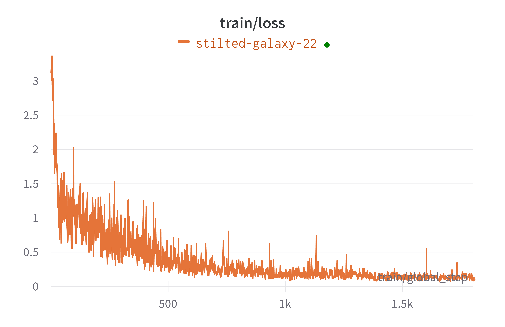
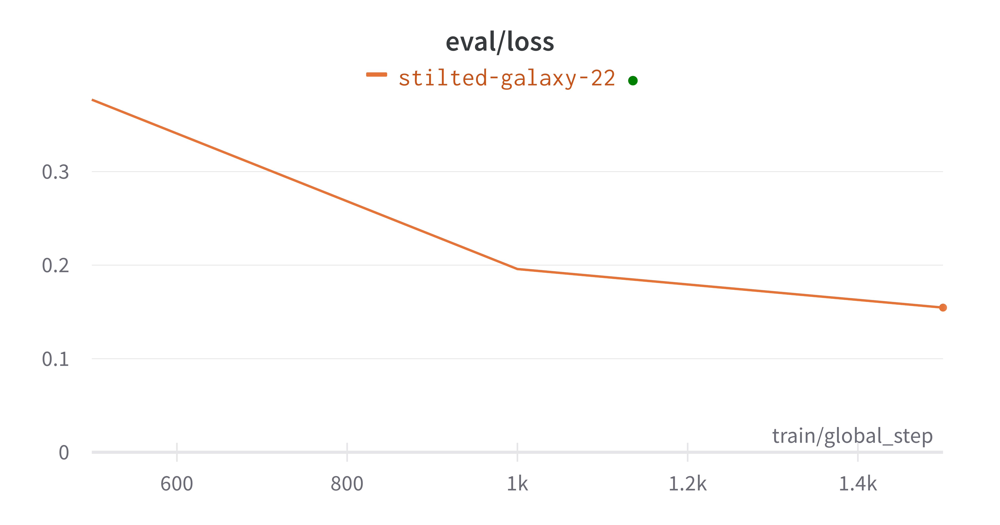

# RIS Domain Specific LLM

This repository contains code for accessing a RIS Domain Specific LLM based off of [Alpaca-LoRA](https://github.com/tloen/alpaca-lora/). We provide the documentation of the training process with user specific data.

In addition to the training code, we publish a script for generating permutations of instructional prompts.

To visualize data, we use [Weights and Balances](wandb.ai).

### Setup

1. As a prerequisite, it is assumed that users will have access to [RIS Compute Services](https://ris.wustl.edu/).

1. Clone the repository to a local directory on your system.
    ```
    git clone https://github.com/WashU-IT-RIS/alpaca-lora.git
    ``` 
1. If not installed already install virtualenv, which we will use to run the virtual environment:
    ```bash
    pip install virtualenv
    ```
1. Open up Terminal, cd to your local directory and activate the virtual environment, which will have the required package dependencies:
    ```
    source openai/bin/activate
    ```
1. Open a new Terminal and Log in to Compute:
    ```
    ssh $user@compute1-client-1.ris.wustl.edu
    ```
1. Create a file in your compute1 $HOME directory called `llm.bsub` containing the following parameters to be used in the job later. Make sure to change your compute group after #BSUB -G and optionally your queue after #BSUB -q:
    ```
    #!/bin/bash
    #BSUB	-q	general (optionally change the queue)
    #BSUB	-G	$your-compute-group
    #BSUB	-M	200GB
    #BSUB	-R	'select[port8004=1]	rusage[mem=32G]'
    #BSUB	-R	'gpuhost'
    #BSUB	-gpu	""
    #BSUB	-a	"docker(registry.gsc.wustl.edu/sleong/alpaca-lora)"
    sleep infinity
    ```
1. Open tmux, which will allow us to continue running jobs in the background, useful for model training.

   ```bash
   tmux
   ```

1. Change the working directory, this will ensure that the $HOME directory is not mounted when running the job:
    ```
   cd /tmp
   ```
1. Submit the following job to LSF, with the location of your own scratch1 location:
    ```
   LSF_DOCKER_VOLUMES="/scratch1/fs1/sleong:$HOME \
    /scratch1/fs1/sleong/flagged:/workspace/flagged \
    " LSF_DOCKER_ENTRYPOINT=/bin/bash LSF_DOCKER_NETWORK=host LSF_DOCKER_IPC=host LSF_DOCKER_SHM_SIZE=64G bsub < ~/llm.bsub
   ```
1. Make note of the job id of the previous job. Submit the following job to go into the container with your own compute group: 
    ```bash
    bsub -Is -q general -a "docker_exec($put_job_id_here)" -G $your_compute_group -R 'gpuhost' -gpu "" /bin/bash
   ```
    Note that it can take up to 5 minutes to load the docker container. Make sure you keep track of the compute node. For example, exec-217.
1. Change the terminal type to xterm to fix key bindings:
    ```bash
   export TERM=xterm
   ```
1. Create a directory within your scratch/fs1 space to store your model files

    ```
    cd ~
    mkdir $directory_name
    ```

1. Open a new local terminal, and use scp to copy `generate.py`, which loads the trained model, from your cloned repository, and the (`/test`) directory, which contains the model weights, to the location of your newly created directory in compute1. 

    ```bash
    scp $full_path_to_generate.py $user@compute1-client-1.ris.wustl.edu:/scratch1/fs1/$compute1_username/$directory_name
    ```
    ```bash
    scp -r $full_path_to_test_directory $user@compute1-client-1.ris.wustl.edu:/scratch1/fs1/$compute1_username/$directory_name
    ```
    As an example:
    ```
    scp /Users/eric0717/internship/ris-llm/alpaca-lora/generate.py e.wang1@compute1-client-1.ris.wustl.edu:/scratch1/fs1/sleong/llm
    ```
    ```
    scp -r /Users/eric0717/internship/ris-llm/alpaca-lora/test e.wang1@compute1-client-1.ris.wustl.edu:/scratch1/fs1/sleong/llm
    ```

1. Back in your Compute1 terminal, run the python script to load model:
    ```
    python3.10 generate.py
   ```


1. In your local working directory, within `views.py`, edit line 13 to match the compute node:
    ```bash
    #relative path of views.py: /chatbot/base/views.py
    client = Client("http://compute1-exec-$Node_Number_Here.ris.wustl.edu:7860/") 
    ```
1. Start the local Django project within your virtual environment terminal by changing the working directory to the location of the Django project and starting the server:
    ```bash
    #changes directory to django project
    cd ./chatbot 
    ```
    ```python
    #starts django project on localhost port 8000
    python manage.py runserver 
    ```

1. 

### Training (`ris-llm.py`)

The file in this repository contains the code for training the model. 

Example usage:

Create a .json file with inputs formatted on your local workspace:

```bash
[
     {
        "instruction": "What are the three primary colors?",
        "input": "",
        "output": "The three primary colors are red, blue, and yellow."
    },
    {
        "instruction": "Describe the structure of an atom.",
        "input": "",
        "output": "An atom is made up of a nucleus, which contains protons and neutrons, surrounded by electrons that travel in orbits around the nucleus. The protons and neutrons have a positive charge, while the electrons have a negative charge, resulting in an overall neutral atom. The number of each particle determines the atomic number and the type of atom."
    }
]
```

Change line 163 in `ris-llm.py` to match your .json file:

```bash
file = open("$json_file", "r")
```
In the same file, update the training output path to your desired output directory at line 184:
```bash
output_dir: str = "./$output_directory_path",
```
Additionally, tweak the relevant hyperparameters at line 185:

```bash
# training hyperparameters
batch_size: int = 2,      # The number of training examples processed in each forward and backward pass. Higher batch size may increase training speed but requires more memory.
micro_batch_size: int = 1,  # Splitting the batch into micro-batches. Useful for models that don't fit in memory. Usually set to 1 unless memory constraints require it.
num_epochs: int = 15,    # The number of times the entire dataset is passed through the model during training. Increasing epochs can lead to better convergence, but too many may cause overfitting. Usually 15 works well for a smaller instruction size of 10.
learning_rate: float = 3e-4,  # The step size at which the model adjusts its parameters during training. Lower values may lead to slower but more stable training, while higher values may cause unstable updates.
cutoff_len: int = 512,  # The maximum length of the output sequence during training. If your output sequences are too long, you may need to increase this value to avoid truncation of responses.

```
In your local terminal, save and use scp to copy both the .json and training file back into your Compute1:

```bash
scp $full_path_to_json $user@compute1-client-1.ris.wustl.edu:/scratch1/fs1/$compute1_username/$model_directory
```
```bash
scp $full_path_to_ris-llm.py $user@compute1-client-1.ris.wustl.edu:/scratch1/fs1/$compute1_username/$model_directory
```
As an example:
```bash
scp /Users/eric0717/internship/ris-llm/alpaca-lora/alpaca_data.json e.wang1@compute1-client-1.ris.wustl.edu:/scratch1/fs1/sleong/llm
```
```bash
scp /Users/eric0717/internship/ris-llm/alpaca-lora/ris-llm.py e.wang1@compute1-client-1.ris.wustl.edu:/scratch1/fs1/sleong/llm
```

From Compute, run the training:
```
python3.10 ris-llm.py
```

Before training begins, the terminal will ask if you would like to visualize results. This is done through Weights and Balances, a Machine Learning Operations platform for Machine Learning development and visualization. To do so, go to [wandb.ai](wandb.ai), create an account, and link the account key. This will sync training attempts with your account.

After training completes, the demo will start on port 7860 at whichever compute node the job is run on. Ex: http://compute1-exec-217.ris.wustl.edu:7860

The weights of the model, or what is needed to start the model in subsequent uses, is stored in the output directory set earlier.

For more information on training details, see [TRAINING.md](TRAINING.md)

### Starting from previously trained weights (`generate.py`)

To start model from previously generated weights, change line 139 to your corresponding output folder from training:
```bash
lora_weights: str = "./$output_folder_from_training",
```

Then make sure to copy the file back to RIS Compute:
```bash
scp $full_path_to_generate.py $user@compute1-client-1.ris.wustl.edu:/scratch1/fs1/$compute1_username/$directory_name
```

Finally, run the model:
```bash
python3.10 generate.py
```
To stop the model, Control + C in the Compute terminal.

The demo will start on port 7860 at whichever compute node the job is run on. Ex: http://compute1-exec-217.ris.wustl.edu:7860


Follow from step 15 in [Setup](README.md#Setup) to run Django server.

### Using (`ris-instruction-gen.py`)

The repository also contains a script to generate additional instructions.

The script reads input data from (`trainingdata/ris_unique_data.json`), and creates 4 additional permutations of the instruction. The resulting data is updated into (`trainingdata/ris_gen_output.json`). Both input and output can be changed within (`ris-instruction-gen.py`) on lines 8 and 11 respectively.

To run, simply start the script:
```bash
python ris-instruction-gen.py
```

Note that sometimes the instruction generation needs to be checked for extra whitespace / numbering.

### Final Results

The most recent model was trained on 1000 instructions, with 200 unique inputs. Training took 44 minutes in total.

Visualized below is the loss function during training (lower is better): 



By comparing the loss value at the start and end of training (3.114, 0.1054), we found that the model has improved by 29.94x. 

And below is the loss function calculated on a validation set, after each training iteration:



Overall, train/loss will continually decrease, while eval/loss may start to increase after a point, which indicates overfitting, where the model will begin to perform worse on new data. So in essence, training loss evaluates model performance on train data, while validation loss evaluates ability to generalize.

#### Limitations

1.  We can improve our model performance if we had a better dataset with more instructions. 
2. Instructions requiring mathematical computations result in less accurate / correct responses

### Example outputs
Visit the Alpaca-LoRA [public demo](https://huggingface.co/spaces/tloen/alpaca-lora) for the base model.

**Instruction**: Tell me about RIS.

**Alpaca-LoRA**: RIS is an acronym for Remote Intelligent Surveillance. It is a type of surveillance system that uses remote sensors to detect and monitor activities in a given area. RIS systems can be used for a variety of applications, such as security, environmental monitoring, and healthcare.

**RIS Trained**: RIS is the Research Infrastructure Services team within WashU IT.

---

**Instruction**: How do I pause specific jobs from a job array in RIS Compute?

**Alpaca-LoRA**: To pause specific jobs from a job array in RIS Compute, you can use the pause() function. For example, if you want to pause job 1, you can use pause(1).

**RIS Trained**: To stop jobs 10, 20 and 55-65 from the job array named blast_array with ID 456: bstop 'my_array[10, 20, 55-65]'

---

**Instruction**: Are RIS Compute users limited in terms of GPU usage?

**Alpaca-LoRA**: No, RIS Compute users are not limited in terms of GPU usage.

**RIS Trained**: We provide services for the entire WashU campus and as such, we suggest a best practices of not over allocating how many resources a single user utilizes. To that point, we suggest that a single user take up no more than 10 GPUs at a time.

---

**Instruction**: What are the current CPU architectures available for RIS Compute?.

**Alpaca-LoRA**: The current CPU architectures available for RIS Compute are x86, x64, ARM, PowerPC, and MIPS.

**RIS Trained**: Current CPU architecture available in the general host group: Intel_Xeon_Gold6242CPU280GHz, Intel_Xeon_Gold6148CPU240GHz

---

**Instruction**: Why am I geting a Disk I/O error on RIS?

**Alpaca-LoRA**: You may be getting a Disk I/O error on RIS if there is not enough free space on the hard drive or if the hard drive is damaged.

**RIS Trained**: This error typically refers to the ability of the job to write a file to a directory. The most common source of the error is a user’s home directory being full. If you encounter this error, please follow the steps below: Use the methods described in the home directory space section section to determine if the home directory is at cap. Remove or move files from the home directory to reduce usage. Attempt to run the job again. If the problem persists, submit a ticket to the service desk: https://ris.wustl.edu/support/service-desk/